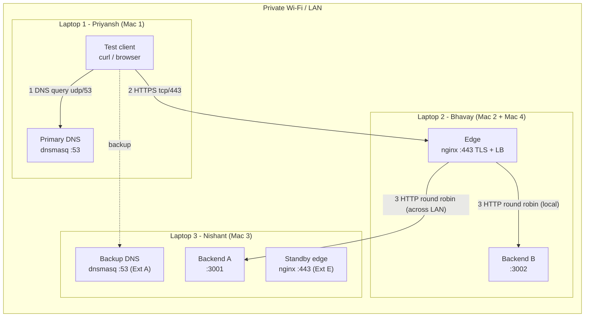

# Architecture Document – Team `team1` (update the IPs before submitting)

**Team:** Priyansh, Bhavay, Nishant · **Domain:** `team1.test` · **Network:** `<SSID>` · `<network>/<prefix>` · gateway `<gateway>`

## 1. Network topology



## 2. Machine roles and IP / service table

| Machine | Member | Interface | IPv4 / prefix | MAC | PDF role(s) | Services (port) | Cloud equivalent |
|---|---|---|---|---|---|---|---|
| Laptop 1 | Priyansh | en0 | `x.x.x.x/nn` | `xx:xx:…` | Mac 1: DNS + client | dnsmasq (53/udp+tcp) | Route 53 private hosted zone |
| Laptop 2 | Bhavay | en0 | `x.x.x.x/nn` | `xx:xx:…` | Mac 2: edge · Mac 4: backend B | nginx (80→443, 443), python (3002) | ALB / CDN edge + EC2 instance |
| Laptop 3 | Nishant | en0 | `x.x.x.x/nn` | `xx:xx:…` | Mac 3: backend A · backup DNS · standby edge | python (3001), dnsmasq (53), nginx standby (443) | EC2 instance, secondary DNS, standby LB |

(Fill in from `evidence/taskA/*.txt`.)

## 3. DNS records (`build/dns/records.hosts`, TTL 30 s)

| Name | Type | Value | Purpose |
|---|---|---|---|
| app.team1.test | A | L2 IP (edge) | the service |
| api.team1.test | A | L2 IP (edge) | API alias |
| dns1 / dns2 / edge / edge-standby / backend-a / backend-b .team1.test | A | infra IPs | diagnostics only |

## 4. Request flow, with the protocol at each layer

```
Client (L1)               DNS (L1)        Edge nginx (L2)                   Backend A (L3) / B (L2)
   | DNS query A app.team1.test |                |                                    |
   |--- UDP :5xxxx -> :53 ----->|                |                                    |
   |<-- A <L2-IP> TTL 30 -------|                |                                    |
   |------------ TCP SYN :5xxxx -> :443 -------->|                                    |
   |<----------- SYN-ACK ------------------------|                                    |
   |------------ ACK --------------------------->|                                    |
   |== TLS ClientHello(SNI)/ServerHello+Cert/Fin=|                                    |
   |== HTTP/2 GET /api/status (encrypted) ======>| TLS terminated                     |
   |                                             |-- new TCP + HTTP/1.1 GET -> :3001 ->| (A, over the LAN)
   |                                             |<- 200 JSON, X-Backend: A ----------|
   |<= 200 JSON, X-Backend: A, X-Edge (encr.) ===|                                    |
```

| Layer | Protocol | Evidence |
|---|---|---|
| Application | DNS, HTTP/2 (client↔edge), HTTP/1.1 (edge↔backend) | `evidence/dns/`, `evidence/http/` |
| Presentation/Session | TLS 1.3 (1.2 for the certificate capture) | pcap: `tls.handshake` |
| Transport | UDP 53, TCP 443, TCP 3001/3002 | pcap: `tcp.flags.syn==1` |
| Network | IPv4, one subnet | `network-info.sh`, ping |
| Link | 802.11 Wi-Fi, MAC addresses | `network-info.sh` |

## 5. Phase 2 additions

| Extension | Change |
|---|---|
| A – Backup DNS | dnsmasq on L3 with identical records. Clients list L1, L3. |
| B – TTL | `local-ttl=30`. Live record change via SIGHUP (`dns-point-app.sh`). |
| C – Isolation | pf anchor `com.apple/cnproject` on L2 and L3: only the edge IP may reach 3001/3002. |
| D – HA | nginx `max_fails=1 fail_timeout=10s`, `proxy_next_upstream error timeout http_502 http_503`. |
| E – Edge migration | standby nginx on L3 (same config + cert). DNS cutover app → L3. |
| SPOF | L2: the only edge, and it also hosts Backend B. Mitigation: VRRP floating IP, a second edge with DNS health checks, or a managed LB. |
