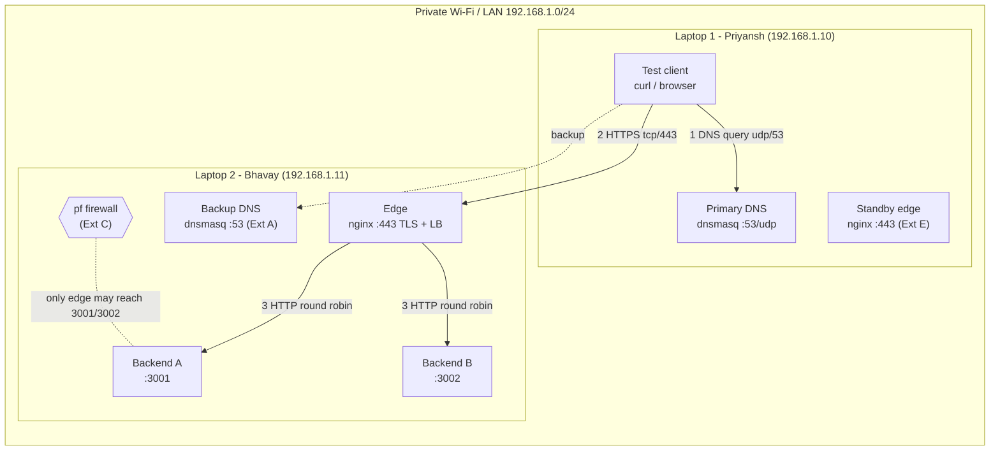

# Architecture Document – Team `team1` (update the IPs before submitting)

**Team:** Priyansh, Bhavay · **Domain:** `team1.test` · **Network:** `<SSID>` · `192.168.1.0/24` · gateway `192.168.1.1`

## 1. Network topology



## 2. Machine roles and IP / service table

| Machine | Member | Interface | IPv4 / prefix | MAC | Roles | Services (port) | Cloud equivalent |
|---|---|---|---|---|---|---|---|
| Laptop 1 | Priyansh | en0 | 192.168.1.10/24 | `xx:xx:…` | Mac 1: DNS + client · standby edge | dnsmasq (53/udp+tcp), nginx standby (443) | Route 53 private zone |
| Laptop 2 | Bhavay | en0 | 192.168.1.11/24 | `xx:xx:…` | Mac 2: edge · Mac 3: backend A · Mac 4: backend B · backup DNS | nginx (80→443, 443), python (3001, 3002), dnsmasq (53) | ALB / CDN edge + EC2 target group |

(Fill in from `evidence/taskA/*.txt`.)

## 3. DNS records (`build/dns/records.hosts`, TTL 30 s)

| Name | Type | Value | Purpose |
|---|---|---|---|
| app.team1.test | A | 192.168.1.11 (edge) | the service |
| api.team1.test | A | 192.168.1.11 (edge) | API alias |
| dns1/dns2/edge/edge-standby/backend-a/backend-b.team1.test | A | infra IPs | diagnostics only |

## 4. Request flow, with the protocol at each layer

```
Client (L1)                    DNS (L1)          Edge nginx (L2)                 Backend A/B (L2)
   | DNS query A app.team1.test  |                    |                                |
   |---- UDP :5xxxx -> :53 ----->|                    |                                |
   |<--- A 192.168.1.11 TTL30 ---|                    |                                |
   |------------ TCP SYN :5xxxx -> :443 ------------->|                                |
   |<----------- SYN-ACK -----------------------------|                                |
   |------------ ACK -------------------------------->|                                |
   |== TLS ClientHello(SNI) / ServerHello+Cert / Fin =|                                |
   |== HTTP/2 GET /api/status  (encrypted) ==========>|  TLS terminated                |
   |                                                  |-- TCP + HTTP/1.1 GET -> :3001 ->|
   |                                                  |<- 200 JSON, X-Backend: A -------|
   |<= 200 JSON, X-Backend: A, X-Edge (encrypted) ====|                                |
```

| Layer | Protocol | Evidence |
|---|---|---|
| Application | DNS, HTTP/2 (client↔edge), HTTP/1.1 (edge↔backend) | `evidence/dns/`, `evidence/http/` |
| Presentation/Session | TLS 1.3 (1.2 for the certificate capture) | pcap: `tls.handshake` |
| Transport | UDP 53, TCP 443, TCP 3001/3002 | pcap: `tcp.flags.syn==1` |
| Network | IPv4 192.168.1.0/24 | `network-info.sh`, ping |
| Link | 802.11 Wi-Fi, MAC addresses | `network-info.sh` |

## 5. Phase 2 additions

| Extension | Change |
|---|---|
| A – Backup DNS | dnsmasq on L2 with identical records. Clients list L1, L2. |
| B – TTL | `local-ttl=30`. Live record change via SIGHUP (`dns-point-app.sh`). |
| C – Isolation | pf anchor `com.apple/cnproject` on L2: only the edge IP may reach 3001/3002. |
| D – HA | nginx `max_fails=1 fail_timeout=10s`, `proxy_next_upstream error timeout http_502 http_503`. |
| E – Edge migration | standby nginx on L1 (same config + cert). DNS cutover app → L1. |
| SPOF | edge nginx / L2. Mitigation: VRRP floating IP, a second edge with DNS health checks, or a managed LB. |
